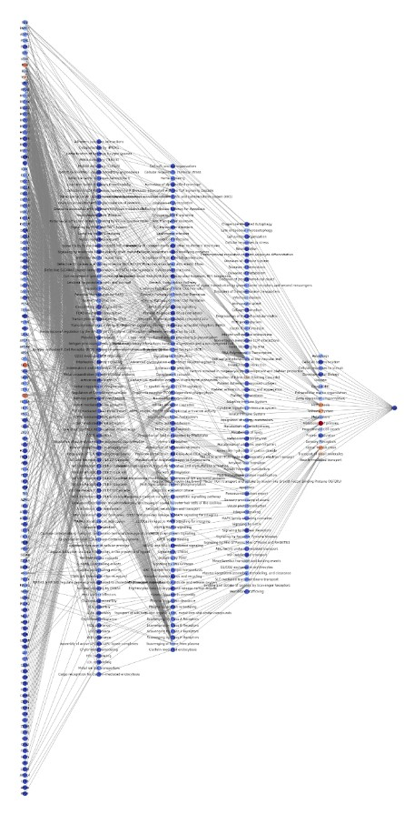
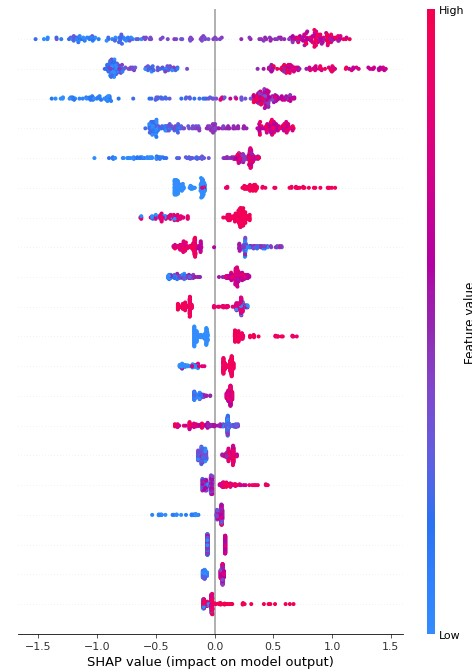

# BMEN35

Notebook and data for exercise in course at LTH (BMEN35).

The exercise is about **sparse neural networks and SHAP values** and is divided into two parts:

- Creating a sparse neural network from a graph.
- Analyzing the importance of features using SHAP (Shapley Additive Explanations)

The notebook is structured for Google Collab. You could also create your own python environment and pip install all the necessary packages if you want to run it locally.

I left markdown notes for where you're supposed to do something. Comments are there for your understanding and may contain minor tasks.

Here is an example of a sparse neural network.

Here is an example of the SHAP output.

